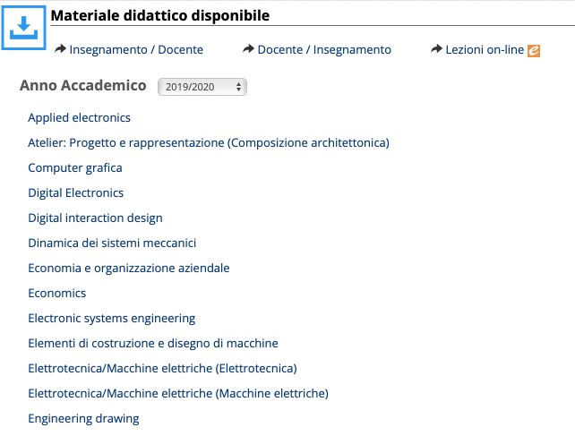

# politoVideoDownloader
A simple python script to download (in bulk) all the video lectures available for a given course.
It must be used for **personal use only**.

# Important notice
All the contents are subjected to Copyright.

The redistribution, sell, editing or any other usage is forbidden without a written authorization.

Any violation will be punished by law.

# Usage

You need python 3 with the following module installed:
- bs4
```
pip3 install bs4
```
- requests
```
pip3 install requests
```

Clone or download the repo and execute the script:
```
python3 poliVideoDownload.py
```

# How to get the videocourse url?
- Go to the page named "Materiale" (you can find it in the top bar) and scroll until you get "Materiale disponibile"
- Follow the istructions in the video

- Copy the url in the address bar and paste it when the software ask for it

# Where will the lectures be saved?
at the moment you can't customize the download location.
You can find the downloaded videos in the "videolectures" folder that will be created in the current folder (where the script was launched)

# Why another downloader for polito videolectures?
<details>
  <summary>Real reason</summary>
  
  Bored during an introduction lecture :grimacing:. 
</details>

Other interesting reasons (difference between this and others one already present on the net):
- No explicit authentication is needed: the script will *not* ask you for username/password.
- It doesn't use Selenium and you don't need any driver 
- Multithreaded download
- Really easy to read, adjust or customize (1 script ~100 LoC)
- You can download all the videolectures available for your account, not just the course you are registered right now.
- Awesome green/red colors :alien: !
# TODOs
- [ ] Filter by title, date, etc
- [ ] Choose which type of video is needed (video, iphone, audio only)
- [ ] Customization of #thread (max concurrent downloads)
- [ ] Support a syncronization option (download just the missing lectures)
